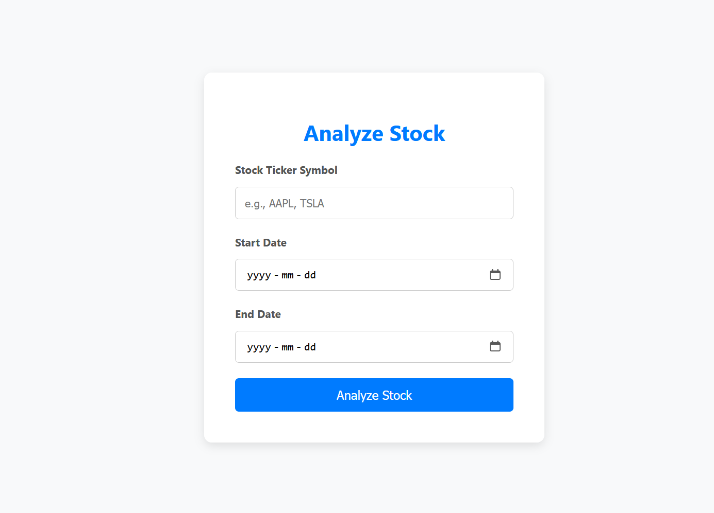
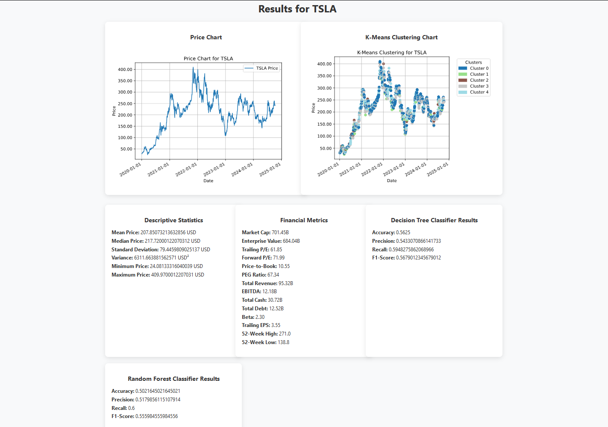
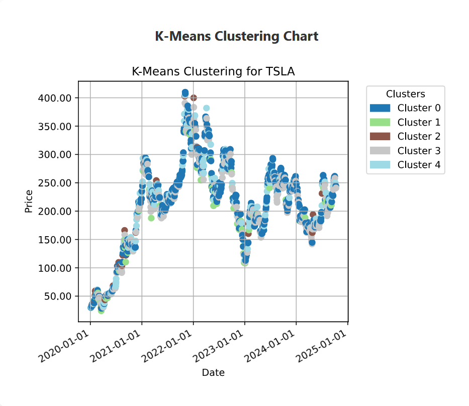
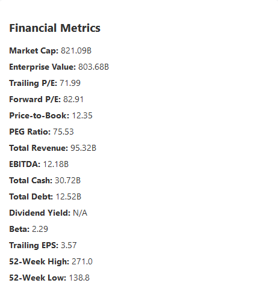
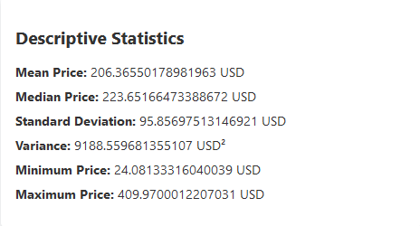

# **Stock Analysis & Portfolio Optimization Web Application**

## **Overview**
This project is a web-based stock analysis platform tailored for **Quantitative Trading** roles. It leverages various machine learning techniques and clustering algorithms to provide traders and quants with insightful price predictions, financial metrics, and statistical analysis for publicly traded stocks. 

The platform is built using **Flask**, with a modern user interface, and provides tools like **decision tree classifiers**, **K-means clustering**, and **financial data visualization**. The ultimate goal of this project is to offer a comprehensive toolkit for exploring, analyzing, and predicting stock price movements with a focus on applying quantitative strategies in real-world trading scenarios.

---

## **Key Features**

- **Stock Price Prediction**: Utilize **Random Forest Classifier** and **Decision Tree Classifiers** to predict future stock price movements based on historical data.

- **Technical Indicators**: Enhanced feature set by including technical indicators such as **Relative Strength Index (RSI)** and **Moving Averages (MA10 and MA50)** for more accurate predictions.

- **Class Imbalance Handling**: Use **SMOTE** from the **imbalanced-learn** library to address class imbalance and improve model performance.

- **Hyperparameter Tuning**: Applied **RandomizedSearchCV** for efficient hyperparameter optimization of machine learning models.

- **Time Series Data Handling**: Ensured proper handling of time-series data by setting `shuffle=False` in `train_test_split` to maintain chronological order.

- **K-Means Clustering**: Analyze stock price behavior and identify potential trends using unsupervised clustering techniques.

- **Financial Metrics**: View detailed financial metrics of a selected stock, including **Market Cap**, **Enterprise Value**, **P/E Ratios**, and more.

- **Descriptive Statistics**: Explore basic stock statistics like **mean**, **median**, **standard deviation**, and **variance** to understand stock price distribution.

- **Interactive Charts**: Visualize stock price history and clusters with dynamic charts powered by **Matplotlib**.

- **Responsive and User-Friendly UI**: A modern, responsive design that provides an intuitive user experience across all devices.

---

## **Screenshots**

1. **Landing Page**  
   

2. **Stock Price Prediction with Decision Tree Classifier**  
   

3. **K-Means Clustering Chart**  
   

4. **Financial Metrics and Descriptive Statistics**  
   
   

---

## **Installation**

### **Prerequisites**
- **Python 3.8+**
- **pip** (Python package manager)
- **Git** (Version control)

### **1. Clone the Repository**

```bash
git clone https://github.com/your-username/stock-analysis-platform.git
cd stock-analysis-platform
```

### **2. Set Up a Virtual Environment (Optional but recommended)**

```bash
python3 -m venv venv
source venv/bin/activate  # For Windows: venv\Scripts\activate
```

### **3. Install Dependencies**

```bash
pip install -r requirements.txt
```

### **4. Run the Application Locally**

```bash
flask run
```

Once the app is running, navigate to `http://127.0.0.1:5000/` in your browser to access the platform.

---

## **Project Structure**

Here's an overview of the main files and directories in the project:

```
├── app.py                     # Main application file for Flask
├── modules/
│   ├── chart_generator.py      # Contains functions for generating stock charts
│   ├── data_fetcher.py         # Fetches financial data and stock prices
│   ├── data_preprocessing.py   # Preprocesses stock data for analysis
│   ├── formatters.py           # Formats stock and financial data
│   ├── price_movement_classifier.py # Contains decision tree classifier for price movement prediction
│   ├── stock_clustering.py     # K-means clustering for stock data
│   └── statistics_calculator.py # Descriptive statistics calculations
├── templates/
│   ├── index.html              # Landing page HTML
│   ├── results.html            # Results page for displaying predictions and metrics
├── static/
│   ├── css/
│   │   ├── index.css           # Styling for the index page
│   │   ├── results.css         # Styling for the results page
├── Procfile                    # Heroku process file
├── requirements.txt            # Python dependencies
└── README.md                   # Project README
```

---

## **Usage**

1. **Analyze Stock**: Enter the stock ticker symbol, select a date range, and choose your preferred analysis method (price prediction or clustering).
2. **View Predictions**: The app generates and displays stock price predictions, clustering charts, financial metrics, and descriptive statistics.
3. **Compare & Explore**: Use the financial and statistical insights to aid in decision-making, and incorporate quantitative trading strategies based on your observations.

---

## **Technologies Used**

- **Flask**: A lightweight Python web framework for building the application backend.
- **Gunicorn**: A production-ready WSGI server to serve the app on platforms like Heroku.
- **Matplotlib**: Used to generate interactive and insightful visualizations for stock data.
- **Pandas**: Essential for data manipulation and calculation of financial metrics and statistics.
- **Scikit-learn**: Utilized for implementing machine learning algorithms (K-Means and Decision Tree).
- **HTML5 & CSS3**: The frontend structure and styling.
- **Heroku**: Platform for hosting and deploying the app.

---

## **Features to Be Added in the Future**

1. **Sentiment Analysis**: Integrating stock news sentiment analysis to predict stock price movement based on market sentiment.
   
2. **Multi-Stock Comparison**: The ability to compare multiple stocks on the same graph to analyze trends and correlations.

3. **Advanced Machine Learning Models**: Implementing more sophisticated models like **Random Forest**, **LSTM (Long Short-Term Memory Networks)**, and **SVM (Support Vector Machines)** for better price prediction accuracy.

4. **User Authentication & Custom Portfolios**: Allowing users to create accounts, save portfolios, and track their selected stocks.

5. **Automated Alerts**: Set up automated alerts to notify users of significant stock price movements or trends via email or SMS.

6. **Backtesting Module**: Add the ability for users to test trading strategies using historical data to evaluate performance.

---

## **Contributing**

Contributions are welcome! If you have suggestions or improvements, please fork the repository, create a new branch, and submit a pull request.

---

## **License**

This project is licensed under the **MIT License**. Feel free to use, modify, and distribute the code.

---

## **Contact**

If you have any questions or need further clarification, feel free to reach out:

- **Email**: aliasadpoor2@gmail.com
- **LinkedIn**: [LinkedIn](https://www.linkedin.com/in/aliasadpoor/)
- **GitHub**: [GitHub](https://github.com/aliplayer1)

---

**Made with ❤️ for Quantitative Traders and Financial Analysts.**

---
